class: middle

# Programme

## Partie 1
1.	Documenter le monde
2. Open data
3. Données à caractère personnel
4. Fonctionnement de la recherche

## Pause

## Partie 2
5. Science ouverte
6. Ouvrir les données de la recherche
7. Quel parcours pour ce type de poste ?

---

class: middle

# Qui suis-je ?

* Cécile Arènes  <a href="https://orcid.org/0000-0002-1839-3530"></a>
* Conservatrice des bibliothèques
* Chargée de mission Données de la recherche et Humanités numériques à la bibliothèque de Sorbonne Université
* Membre du GTSO données de Couperin et du collège Données du CoSO

---

class: center, inverse, middle

# Tour de table

---

class: middle
background-color: #bebebe

# Vos attentes

* Votre nom
* Votre parcours
* Un souhait pour cette demi-journée

---

class: middle
background-color: #bebebe

# Données publiques, science ouverte, données ouvertes ?

* En avez-vous entendu parler ?
* Spontanément, qu'est-ce que c'est pour vous ?

---

class: center, inverse, middle

# Documenter le monde

---

class: middle

# Documenter le monde : avant - 1

.pull-left[
- Au cours du 17e siècle, on passe du registre, largement utilisé depuis le 13e siècle, à la fiche.

- La fiche est plus facile à manipuler, à déplacer et à classer.

- Voir : Bert, Jean-François. Une histoire de la fiche érudite. Nouvelle édition [en ligne]. Villeurbanne : Presses de l’enssib, 2017 (généré le 31 décembre 2021). Disponible sur Internet : <http://books.openedition.org/pressesenssib/6211>
]

.pull-right[
```{r echo=FALSE, out.height=500, out.width=400}

```
]

---

class: middle

.pull-left[
# Documenter le monde : avant - 2

## Un précurseur, Paul Otlet
]

.pull-right[
```{r echo=FALSE, out.height=200, out.width=150}
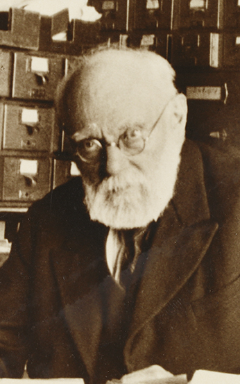
```
]

- 1895 : Création de l’Office international de bibliographie (OIB). Objectif : élaborer un Répertoire Bibliographique Universelle (RBU), sorte de bibliographie du savoir humain rassemblant les notices de tous les ouvrages publiés dans le monde quel qu’en soit le sujet ou le temps. 
- 1919-1920 : ouverture du Mundaneum, centre scientifique documentaire, éducatif et social
- Notion de "document" très élargie : outre les livres, prise en compte d'une grande variété de supports

&nbsp;

<small>« Savoirs CDI: Paul Otlet ». s. d. Consulté le 4 janvier 2022. https://www.reseau-canope.fr/savoirscdi/index.php?id=524.</small>

---

class: middle

.pull-left[
# Documenter le monde : avant - 3

## Un précurseur, Paul Otlet - suite
]

.pull-right[
```{r echo=FALSE, out.height=200, out.width=150}

```
]

- Anticipe la notion d'hypertexte : "complexe de machines associées pouvant réaliser sept opérations dont « l’établissement des documents de manière à ce que chaque donnée ait son individualité propre et dans ses relations avec celles de tout l’ensemble, qu’elle y soit rappelée là où il est nécessaire"
- Anticipe aussi l'internet : "Réseau universel d’information et de documentation, capable de mettre en relation tous les organismes particuliers de documentation. Sous nos yeux, écrit-il, est en voie de se constituer une immense machinerie pour le travail intellectuel. Elle se constitue par la combinaison des différentes machines existantes, dont les liaisons nécessaires s’entrevoient. Cette machinerie constituerait un véritable cerveau mécanique et collectif"

&nbsp;

<small>« Savoirs CDI: Paul Otlet ». s. d. Consulté le 4 janvier 2022. https://www.reseau-canope.fr/savoirscdi/index.php?id=524.</small>

---

class: middle

# Documenter le monde : avant - 4

## La notion d'hypertexte

- Au croisement de l'informatique et de la documentation
- 1945 : notion de Memex (pour Memory Extender), Vannevar Bush : " sorte de bibliothèque et de fichier mécanisés. C’est un dispositif dans lequel un individu stocke ses livres, ses enregistrements, toutes les informations qu’il reçoit, automatisées de telle manière qu’il puisse compulser l’ensemble avec le maximum de rapidité et de liberté "
- années 1960 : expérimentations de Douglas Engelbart et Ted Nelson et création du terme "hypertexte"

&nbsp;

<small>Serres, Alexandre. 1995. « Hypertexte : une histoire à revisiter », 1995 https://archivesic.ccsd.cnrs.fr/sic_01180259/.</small>

---

class: middle

# Documenter le monde : maintenant - 1

- 1973 : création du protocole TCP/IP par Vint Cerf : ensemble des règles de communication sur internet et se base sur la notion adressage IP
- 1989 : Tim Berners Lee "invente" le web : 
  - attribution d'une adresse à chaque document (URL) afin de le localiser dans le système et liens entre les pages créées par un système de liens hypertextes.  
  - ajout d'un protocole de transfert, http, et un langage, html, complètent le dispositif

.center[
```{r echo=FALSE, out.height=200, out.width=300}
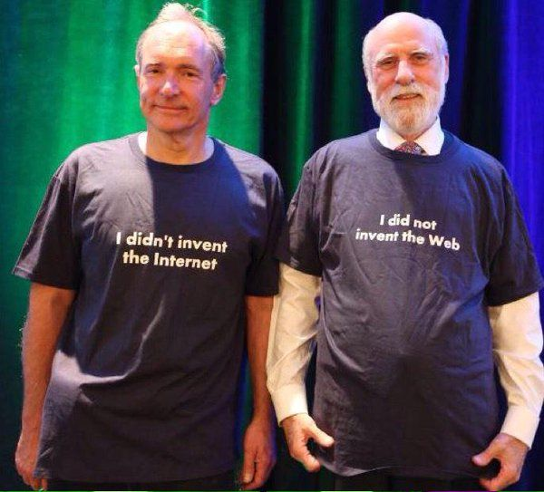
```
]

---

class: middle

# Documenter le monde : maintenant - 2

- Web sémantique : évolution du web, qui permet d'utiliser les données structurées (par exemple, les métadonnées contenues dans un catalogue de bibliothèque) et de les rendre intéropérables
- Web de données : 
  - promouvoir une vision du Web comme une base de données globale,
  - relier les données sur le Web de la même façon que l'hypertexte permet de relier des documents (les pages Web)

&nbsp;

<small>Source : https://archive.wikiwix.com/cache/index2.php?url=http%3A%2F%2Fwww.bnf.fr%2Ffr%2Fprofessionnels%2Fweb_semantique_donnees%2Fs.web_semantique_intro.html</small>

---

class: middle

# Nouvelles évolutions

- Big data et IA, nouvelles logiques : on ne classe plus en amont, mais on cherche dans la masse (en résumant à gros traits). 
- Notion de 4e paradigme :
  - 1er paradigme (il y a 1000 ans) : recherche empirique pour décrire les phénomènes naturels
  - 2e paradigme (depuis 100 ans) : recherche théorique, à partir de modèles et de généralisations
  - 3e paradigme (depuis quelques décennies) : recherche informatisée basée sur des simulations de phénomènes complexes
  - 4e paradigme (aujourd’hui) : exploration de données, intégration des théories, simulations et expérimentations

&nbsp;

Grande heure de gloire de la donnée

&nbsp;

<small>Source : https://lalist.inist.fr/?p=8013 et https://docs.google.com/presentation/d/1nh5Sv-CjUUMlc30BK-gE8Z2Hun7ZvIOx/edit?usp=sharing&ouid=102297717099282383677&rtpof=true&sd=true (slide 5)</small>

---

class: middle
background-color: #7a6666

# Idée reçue 1

- Idée reçue 1 : les données sont-elles uniquement numériques ?
- Question qui gratte : les données ne seraient-elles pas des archives ?

---

class: center, inverse, middle

# Open data

---

# Le mouvement de l'open data : des initiatives anciennes

* 1992 : première banque de données génétique [Genbank](https://www.ncbi.nlm.nih.gov/genbank/)
* 2007 : travaux sur l’[Open government data à l’initiative](https://opengovdata.org/) de Lawrence  Lessig,  Tim  O’Reilly,  Ethan  Zuckermann,  Joseph  Hall,  Aaron  Schwartz et Carl Mamamud

.center[
```{r echo=FALSE, out.height=182, out.width=1020}
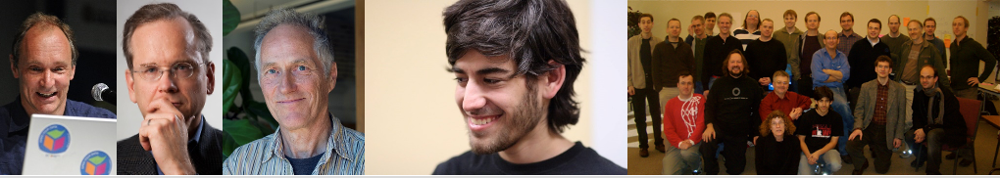
```
]

**Principes : accessibilité, données non-propriétaires, licences ouvertes, etc.**  

<small>Sources : Silvio Tanaka, « Tim Berners-Lee, CC BY 2.0. https://commons.wikimedia.org/wiki/File:Tim_Berners-Lee_CP.jpg. Lessig 2016, CC BY 2.0. https://commons.wikimedia.org/wiki/File:Lawrence_Lessig_Headshot.jpg. Christopher Michel, “Tim O’Reilly”, CC BY 2.0. https://commons.wikimedia.org/wiki/File:Tim_O%27Reilly_-_2017_(38700700672)_(cropped).jpg. Sage Ross, CC BY-SA 2.0. https://commons.wikimedia.org/wiki/File:Aaron_Swartz_2_at_Boston_Wikipedia_Meetup,_2009-08-18.jpg. David Orban, CC:BY, Open Government Working Group. https://www.flickr.com/photos/davidorban/2095565103/in/album-72157603410393877/</small>

---

# Le mouvement de l'open data : du côté du web

[Echelle 5 étoiles](https://5stardata.info/fr/), Tim Berners-Lee, 2006

- ★ publiez vos données sur le Web (peu importe leur format) avec une licence ouverte
- ★★ publiez-les en tant que données structurées (par exemple, un document Excel au lieu d’une image scannée d’un tableau)
- ★★★ publiez-les dans un format ouvert et non-propriétaire (par exemple, un CSV plutôt qu’un Excel)
- ★★★★ utilisez des URI pour désigner des choses dans vos données, 
afin que les gens puissent faire des références à celles-ci
- ★★★★★ liez vos données à d’autres données pour y ajouter du contexte

.center[
```{r echo=FALSE, out.height=150, out.width=350}
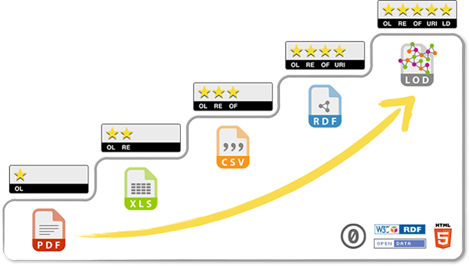
```
]

---

# Ouvrir les données, un enjeu économique 

.pull-left[
```{r echo=FALSE, out.height=400, out.width=300}
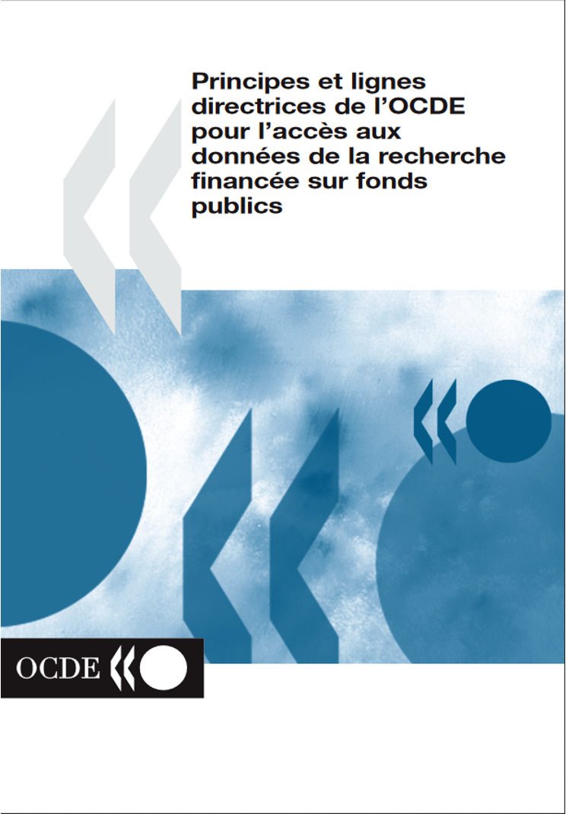
```
]

.pull-right[
2007 : Parution du rapport de l’OCDE, « Principes et lignes directrices de l’OCDE pour l’accès aux données de la recherche financée sur fonds publics ». http://www.oecd.org/fr/science/inno/38500823.pdf 
]

---

# Le mouvement de l'open data : répondre à une attente citoyenne

* Sous l'impulsion de Barack Obama, lancement de l'[Open government partnership](https://www.opengovpartnership.org/), 2011, une initiative réunissant près de 80 pays
* « OGP’s vision is that more governments become sustainably more transparent, more accountable, and more responsive to their own citizens, with the ultimate goal of improving the quality of governance, as well as the quality of services that citizens receive. »

.center[]

---

.pull-left[# En Europe
]

.pull-right[
```{r echo=FALSE, out.height=100, out.width=150}

```
]

[Directive européenne sur les données ouvertes et la réutilisation des informations du secteur public](https://eur-lex.europa.eu/eli/dir/2019/1024/oj/eng), juin 2019 (2019/1024)

>« Les informations du secteur public constituent une **source extraordinaire de données qui peuvent contribuer à améliorer le marché intérieur** et à développer de nouvelles applications pour les consommateurs et les personnes morales. L'utilisation intelligente de données, y compris leur traitement par des applications utilisant l'intelligence artificielle, peut avoir un **effet de transformation sur tous les secteurs de l'économie**. » (considérant 9)

&nbsp;

[Une stratégie européenne pour les données, communication de la commission au parlement](https://ec.europa.eu/info/sites/default/files/communication-european-strategy-data-19feb2020_fr.pdf), février 2020 (COM(2020) 66 final)

> «  Outre la création de **neuf espaces européens communs des données**, les travaux se poursuivront sur le nuage européen pour la science ouverte (**EOSC**), qui offre un **accès ininterrompu et une réutilisation fiable des données de la recherche aux chercheurs européens, aux innovateurs, aux entreprises et aux citoyens**, grâce à un environnement distribué des données fiable et ouvert et à des services connexes. »

---

# Le mouvement de l'open data : en France

* Ouverture de [data.gouv.fr](https://www.data.gouv.fr/fr/) en 2011
* Création de la mission interministérielle [Etalab](https://www.etalab.gouv.fr/qui-sommes-nous) en 2013 
* Pour une action publique transparente et collaborative : plan d’action national pour la France, 2015-2017, puis 2018-2020. Nouveau plan en 2021
  * 21 engagements : engagement 18 : « Construire un écosystème de la science ouverte »
* **Partenariat pour un gouvernement ouvert** [2021-2023](https://www.modernisation.gouv.fr/transformer-laction-publique/partenariat-pour-un-gouvernement-ouvert)

&nbsp;

.center[]

---

.pull-left[
# Actualités de l'open data 

## [Rapport Bothorel](https://www.gouvernement.fr/remise-du-rapport-sur-la-politique-publique-de-la-donnee-des-algorithmes-et-des-codes-sources), 2020
]

.pull-right[
```{r echo=FALSE, out.height=200, out.width=125}
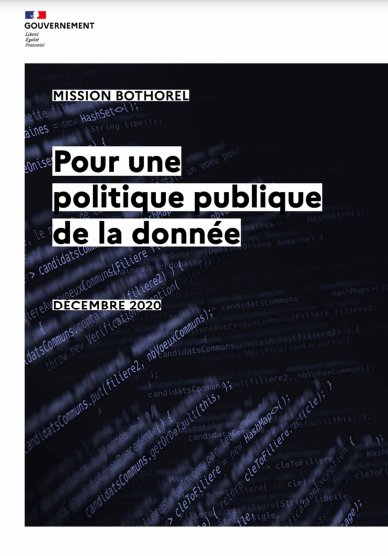
```
]

**Enjeux** :
  * analyser les opportunités stratégiques et financières et les freins à lever pour favoriser l’ouverture par défaut des données et codes sources publics ;
  * déterminer les conditions d’une accélération de la politique d’ouverture ou de partage des données d’intérêt général produites ou collectées dans le secteur privé.
  
**Objectifs** :
  * une plus grande transparence vis-à-vis du public ; 
  * un gain en performance et en réactivité dans des situations d'urgence grâce au recueil d'informations ;
  * un levier économique pour la création de nouveaux services ou d'entreprises innovantes, en particulier dans les secteurs de l'intelligence artificielle ;
  * une meilleure évaluation des politiques publiques grâce au croisement de données issues de différentes administrations.

---

# La feuille de route du MESRI pour les données et les codes

.pull-left[
```{r echo=FALSE, out.height=400, out.width=300}
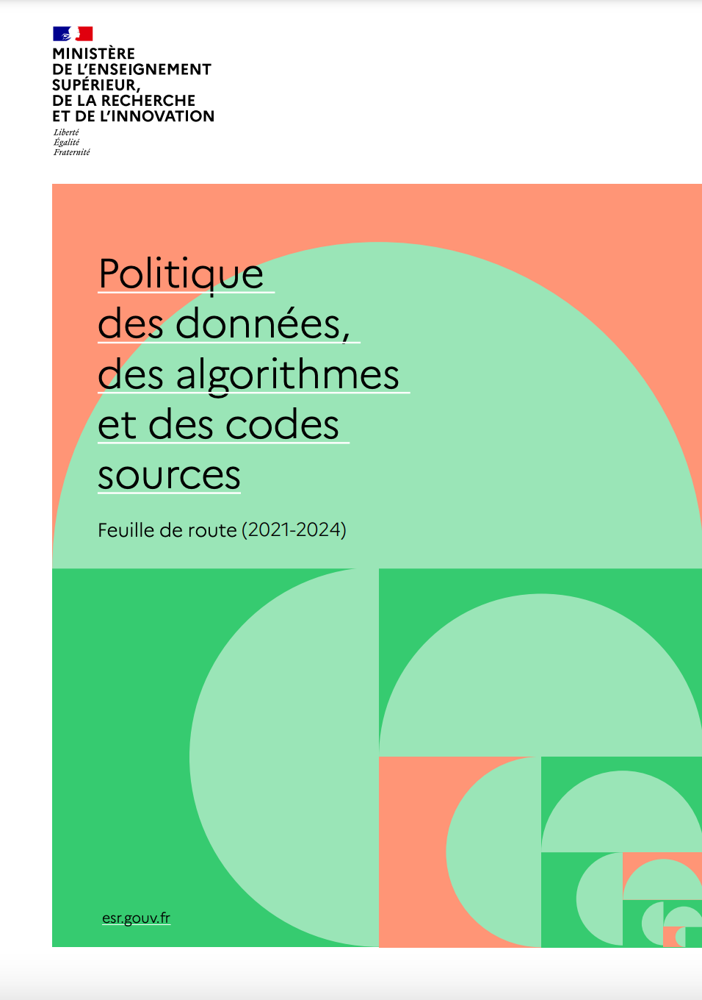
```
]

.pull-right[
[Politique des données, des algorithmes et des codes sources](https://cache.media.enseignementsup-recherche.gouv.fr/file/politique_des_donnees/50/1/Strategie-donnees-algorithmes-codes-210922_1419501.pdf), 2021-2024.

* Structurer, ouvrir et partager les données de recherche - Action 6
* Accompagner les chercheurs dans la gestion des données et le « FAIR by design » - Action 9
* Collecter, préserver et partager les codes sources – Software Heritage - Action 11
* Accélérer les demandes d'accès des chercheurs aux données publiques - Actions 18 & 9 
* Favoriser l'accès des chercheurs aux données d'intérêt général -  Action 20
* Accompagner l’adoption de licences libres - Action 45
]

---

# La [feuille de route du MCC pour les données et les codes](https://www.culture.gouv.fr/Espace-documentation/Documentation-administrative/Feuille-de-route-Donnees-et-contenus-culturels)

**Objectifs** : 
  * Améliorer la capacité du ministère à diffuser et rendre visible les contenus culturels ; 
  * Contribuer à l’efficacité des actions du ministère et à la simplification des relations entre les usagers et le service public culturel ; 
  * Faire bénéficier un secteur économique de la culture fragilisé par la crise COVID19 des opportunités de reprise et de développement présentées par l’usage des données. 
  
**Moyens** : 
  * Accélérer l’ouverture des données publiques, algorithmes et codes sources, tant en nombre d’institutions partageant des données qu’en quantité de données disponibles ; 
  * Travailler sur la qualité des données ouvertes et les moyens techniques permettant interopérabilité et réutilisations ; 
  * Acculturer le ministère et son réseau d’opérateurs à l’utilisation de la donnée non seulement comme moyen d’information, mais aussi de pilotage, d’innovation et de développement économique.

---

class: center, middle
background-color: #bebebe

# Activité 

## Données publiques ville de Paris

Trouver les 10 titres les plus prêtés par les bibliothèques de la ville de Paris :

&nbsp;

https://opendata.paris.fr/

---

class: center, inverse, middle

# Données à caractère personnel

---

# Données personnelles : définition

**toute information relative à une personne physique susceptible d'être identifiée, directement ou indirectement.**  
  
Par exemple : un nom, une photo, une empreinte, une adresse postale, une adresse mail, un numéro de téléphone, un numéro de sécurité sociale, un matricule interne, une adresse IP, un identifiant de connexion informatique, un enregistrement vocal, etc.   
  
Peu importe que ces informations soient confidentielles ou publiques.  
  
**A noter** : pour que ces données ne soient plus considérées comme personnelles, elles doivent être rendues anonymes de manière à rendre impossible toute identification de la personne concernée : noms masqués, visages floutés, etc.  
  
**Attention** : s'il est possible par recoupement de plusieurs informations (âge, sexe, ville, diplôme, etc.) ou par l'utilisation de moyens techniques divers, d'identifier une personne, les données sont toujours considérées comme personnelles.

Source : CNIL. Une donnée à caractère personnel, c'est quoi ? https://www.cnil.fr/fr/cnil-direct/question/une-donnee-caractere-personnel-cest-quoi

---

# Recueil de données sensibles

**Description du risque : décrire les données sensibles collectées**

* Données personnelles 
* Données de patients 
* Données biologiques

**Gestion du risque : identifier les personnes qui vont vous aider à gérer les données sensibles**

* Protection renforcée 
  * Autorisation d'accès 
  * Sécurité renforcée du stockage des données 
* Diffusion des données 
  * Anonymisation réversible ou irréversible 
  * Pseudonymisation 
  * Limitation de la réutilisation à certains usages 
  * Demande d'autorisation d'accès

<small>Source : Puren, Marie. 2021. « Créer son plan de gestion des données ». École thématique. Lille, France: MESH, Lille. https://hal.archives-ouvertes.fr/hal-03183724.</small>

---

class: middle

# Gestion de données sensibles

**Description du risque** 

* Difficultés pour collecter des données sensibles (autorisations à obtenir)
* Délais pour collecter des données sensibles 
* Difficultés à gérer l'échange de données entre partenaires 
* Difficultés de curation : du nettoyage des données à leur stockage 

**Gestion du risque : identifier les personnes qui vont pouvoir vous aider à gérer ces risques**

* Décrire les démarches à effectuer pour obtenir des autorisations 
* Evaluer les délais 
* Mettre en place un protocole d'échange détaillé en collaboration avec les partenaires
* Envisager toutes les difficultés éventuelles dans la curation des données avec les services supports

<small>Source : Puren, Marie. 2021. « Créer son plan de gestion des données ». École thématique. Lille, France: MESH, Lille. https://hal.archives-ouvertes.fr/hal-03183724.</small>

---

class: center, middle
background-color: #bebebe

# Activité 

## Données personnelles

Quelques questions sur le RGPD  

&nbsp;

https://blog.atinternet.com/fr/rgpd-quiz-15-questions-pour-tester-vos-connaissances/

---

class: middle

# Le RGPD : bases légales

Il est permis de traiter des données personnelles lorsque le traitement repose sur une des 6 bases légales mentionnées à l’article 6 du RGPD :  

* le **consentement** : la personne a consenti au traitement de ses données ;
* le contrat : le traitement est nécessaire à l’exécution ou à la préparation d’un contrat avec la personne concernée ;
* l’obligation légale : le traitement est imposé par des textes légaux ;
* la **mission d’intérêt public** : le traitement est nécessaire à l’exécution d’une mission d’intérêt public ;
* l’intérêt légitime : le traitement est nécessaire à la poursuite d’intérêts légitimes de l’organisme qui traite les données ou d’un tiers, dans le strict respect des droits et intérêts des personnes dont les données sont traitées ;
* la sauvegarde des intérêts vitaux : le traitement est nécessaire à la sauvegarde des intérêts vitaux de la personne concernée, ou d’un tiers.

<small>Source : CNIL. « La licéité du traitement : l’essentiel sur les bases légales prévues par le RGPD ». Consulté le 3 octobre 2021. https://www.cnil.fr/fr/les-bases-legales/liceite-essentiel-sur-les-bases-legales.</small>

---

class: middle

# Principes du RGPD

Les 5 grands principes des règles de protection des données personnelles sont les suivants :

* Le principe de **finalité** : le responsable d'un fichier ne peut enregistrer et utiliser des informations sur des personnes physiques que dans un but bien précis, légal et légitime ;
* Le principe de **proportionnalité et de pertinence** : les informations enregistrées doivent être pertinentes et strictement nécessaires au regard de la finalité du fichier ;
* Le principe d'une **durée de conservation limitée** : il n'est pas possible de conserver des informations sur des personnes physiques dans un fichier pour une durée indéfinie. Une durée de conservation précise doit être fixée, en fonction du type d'information enregistrée et de la finalité du fichier ;
* Le principe de **sécurité et de confidentialité** : le responsable du fichier doit garantir la sécurité et la confidentialité des informations qu'il détient. Il doit en particulier veiller à ce que seules les personnes autorisées aient accès à ces informations ;
* Les **droits des personnes**

<small>Source : CNIL. « Quels sont les grands principes des règles de protection des données personnelles ? ». Consulté le 3 octobre 2021. https://www.cnil.fr/fr/cnil-direct/question/quels-sont-les-grands-principes-des-regles-de-protection-des-donnees.</small>

---

class: middle

# Travailler avec son délégué à la protection des données

* Fonction obligatoire : une personne nommée par établissement
* Les "**traitements**" de données personnelles sont à déclarer
* Le détenteur de données personnelles doit remplir une **fiche de registre d'activité** :
  * Nom des responsables du traitement
  * Coordonnées du sous-traitant (si nécessaire)
  * **Population concernée**
  * **Finalité** de traitement
  * Énumération des tâches effectuées pour le traitement
  * Informations communiquées aux personnes concernées
  * Échanges de données (si nécessaire)

<small>Source : DoRANum. « RGPD – Protection des données personnelles et RGPD dans la recherche : conséquences, obligations, implications ». Consulté le 3 octobre 2021. https://doranum.fr/aspects-juridiques-ethiques/protection-des-donnees-personnelles-et-rgpd-dans-la-recherche-consequences-obligations-implications/.</small>

---

class: center, middle
background-color: #bebebe

# Activité 

## Protéger la vie privée

Un petit exercice éloquent 

&nbsp;

https://cpg.doc.ic.ac.uk/observatory/explore 

---

class: center, inverse, middle

# Fonctionnement de la recherche

---

class:middle

# Fonctionnement de la recherche

- **Avant** : des crédits annuels
- **Après** : un financement sur projet soumis à des agences de financements
- Les **agences de financement** françaises : ANR, INCa, ADEME, ...
- Taux de **réussite** : environ 15%
- Signature d'une **déclaration commune en faveur de la science ouverte**
- Engagements pour les équipes financées : accès ouvert aux publications, plan de gestion des données, (et bientôt ouverture des données ?)

---

class: center, middle
background-color: #bebebe

# Activité 

## La recherche en train de se faire 

Observez les appels à projet en cours https://www.appelsprojetsrecherche.fr/

&nbsp;

Discussion

---

class: center, inverse, middle

# Science ouverte

---

class: middle

# Science ouverte : définition

Un terme ombrelle :

> “Open Science is the practice of science in such a way that others can collaborate and contribute, where research data, lab notes and other research processes are freely available, under terms that enable reuse, redistribution and reproduction of the research and its underlying data and methods.”

<small>FOSTER. s. d. « Open Science Definition ». Consulté le 3 octobre 2021. https://www.fosteropenscience.eu/foster-taxonomy/open-science-definition.</small>

---

# La science ouverte, une nouveauté ? 

.pull-left[
- 1665 : Philosophical Transcations
- 1665 : Journal des sçavans
]

.pull-right[
- 1942 : Robert Merton, "universalisme", "communalisme", "désintéressement" et "scepticisme organisé"
]

.pull-left[
```{r echo=FALSE, out.height=166, out.width=228}
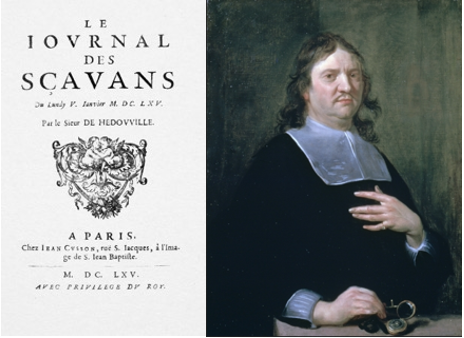
```
]

.pull-right[
```{r echo=FALSE, out.height=164, out.width=113}
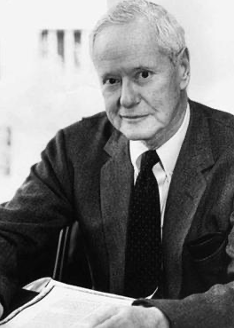
```
]

&nbsp;

<small>Illustrations : Wikimedia Commons, Royal Society</small>

---

# Loi pour une République numérique, 2016 - 1

.center[
```{r echo=FALSE, out.height=100, out.width=100}
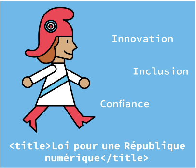
```
]

**Titre Ier : la circulation des données et du savoir : article 6**

Les administrations publient en ligne les documents administratifs suivants :
>« 1° Les documents qu'elles communiquent en application des procédures prévues au présent titre, ainsi que leurs versions mises à jour ;

>« 3° Les bases de données, mises à jour de façon régulière, qu'elles produisent ou qu'elles reçoivent et qui ne font pas l'objet d'une diffusion publique par ailleurs ;

>« 4° Les **données, mises à jour de façon régulière, dont la publication présente un intérêt économique, social, sanitaire ou environnemental**.

---

# Loi pour une République numérique, 2016 - 2

.center[
```{r echo=FALSE, out.height=100, out.width=100}

```
]

**Open research data : article 30**

>« II.- Dès lors que les données issues d'une activité de recherche **financée au moins pour moitié** par des dotations de l'Etat, des collectivités territoriales, des établissements publics, des subventions d'agences de financement nationales ou par des fonds de l'Union européenne ne sont pas protégées par un droit spécifique ou une réglementation particulière et qu'elles ont été rendues publiques par le chercheur, l'établissement ou l'organisme de recherche, **leur réutilisation est libre**.

>« III.- L'éditeur d'un écrit scientifique mentionné au I ne peut limiter la réutilisation des données de la recherche rendues publiques dans le cadre de sa publication.

---

# La science ouverte en France

* Plan national pour la science ouverte, 2018 et 2021.

> « La France s’engage pour que les résultats de la recherche scientifique soient ouverts à tous, chercheurs, entreprises et citoyens, sans entrave, sans délai, sans paiement. »

.center[
```{r echo=FALSE, out.height=300, out.width=250}

```
]

---

class: center, middle
background-color: #bebebe

# Activité 

## Que savez-vous de la science ouverte ?

&nbsp;

**Quizz**

&nbsp;

Source : Marlène Delhaye, Isabelle Gras, Julien Caugant, & Caroline-Sophie Donati. (2020, September 22). « À l'asSO ! » : apprentissage ludique de la Science Ouverte à AMU. Zenodo. https://doi.org/10.5281/zenodo.4043644

---

class: center, middle
background-color: #bebebe

# Quizz science ouverte

## Pour progresser dans leur carrière, les chercheurs doivent prioritairement

1. Publier le plus d'articles possibles
2. Publier l'article le plus long
3. Publier dans les revues scientifiques à forte notoriété

---

class: center, middle
background-color: #bebebe

# Quizz science ouverte

## Qu'est-ce qu'un data paper ?

1. Un journal qui vous donne la date exacte
2. Un article de revue qui décrit un jeu de données
3. Un article identifié par sa date de soumission

---

class: center, middle
background-color: #bebebe

# Quizz science ouverte

## Qu'est-ce que le "cloud" ?

1. Une nouvelle danse
2. Un amas nuageux dans le ciel
3. Des serveurs distants de stockage de données

---

class: center, middle
background-color: #bebebe

# Quizz science ouverte

## Qu'est-ce qu'un entrepôt de données ?

1. Un magasin où l'on entrepose des objets à donner
2. Une infrastructure pour stocker, rechercher et accéder aux données numériques
3. Un disque dur externe pour stocker des fichiers

---

class: center, middle
background-color: #bebebe

# Quizz science ouverte

## Qu'est-ce que la licence CC0 ?

1. Une licence qui n'engage à rien
2. Une licence qui permet de placer son oeuvre au plus près du domaine public
3. Une licence qui permet d'abandonner tous ses droits d'auteur (dans la limite de ceux exigés par la loi)
4. Cette licence n'existe pas

---

class: center, middle
background-color: #bebebe

# Quizz science ouverte

## Qu'est-ce que la version postprint d'un article ?

1. La version de l'article publié avec les rectificatifs apportés après publication
2. La version corrigée et validée par les pairs avant sa mise en page par la revue
3. La version en ligne de l'article après sa publication dans la revue papier

---

class: center, middle
background-color: #bebebe

# Quizz science ouverte

## Puis-je utiliser une photographie issue de Google image où aucun individu n'apparaît ?

1. Vrai
2. Faux

---

class: center, middle
background-color: #bebebe

# Quizz science ouverte

## Dans la carrière du chercheur, le libre accès permet

1. La diffusion et la citation des travaux du chercheur
2. La libre exploitation des documetns du chercheur
3. L'accès aux savoirs
4. De répondre aux critères par les organismes de financements

---

class: center, middle
background-color: #bebebe

# Quizz science ouverte

## Les articles publiés en libre accès sont plus cités que les autres articles

1. Vrai
2. Faux

---

class: center, middle
background-color: #bebebe

# Quizz science ouverte

## Les chercheurs qui relisent des articles de revue ne sont pas rémunérés par la revue

1. Vrai
2. Faux

---

class: center, middle
background-color: #bebebe

# Quizz science ouverte

## Une licence Creative Commons associée à une publication permet d'en fixer les règles d'utilisation

1. Vrai
2. Faux

---

class: center, middle
background-color: #bebebe

# Quizz science ouverte

## Quelle image symbolise le libre accès ?

1. Un cadenas ouvert
2. Un oeil
3. Une fleur

---

class: center, middle
background-color: #bebebe

# Quizz science ouverte

## Qu'est-ce qu'un éditeur prédateur ?

1. Un éditeur avec des frais de publication élevés
2. Un éditeur sans rigueur scientifique, motivé par le profit
3. Un éditeur qui mange les chercheurs

---

class: center, middle
background-color: #bebebe

# Quizz science ouverte : source

Source : Marlène Delhaye, Isabelle Gras, Julien Caugant, & Caroline-Sophie Donati. (2020, September 22). « À l'asSO ! » : apprentissage ludique de la Science Ouverte à AMU. Zenodo. https://doi.org/10.5281/zenodo.4043644

---

# Le plan national pour la science ouverte 1, 2018

.center[
```{r echo=FALSE, out.height=250, out.width=200}
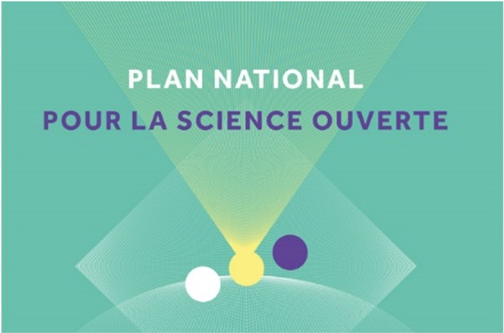
```
]

**Axe 2, structurer et ouvrir les données de la recherche**

* Rendre obligatoire la diffusion ouverte des données de recherche issues de programmes financés par appels à projets sur fonds publics.
* Créer la fonction d’administrateur des données et le réseau associé au sein des établissements.
* Créer les conditions et promouvoir l’adoption d’une politique de données ouvertes associées aux articles publiés par les chercheurs.

---

class: middle

# Le plan national pour la science ouverte 2, 2021

**Axe 2 : structurer, partager et ouvrir les données de la recherche**

* Mettre en œuvre l’obligation de diffusion des données de recherche financées sur fonds publics
* Créer Recherche Data Gouv, la plateforme nationale fédérée des données de recherche
* Promouvoir l’adoption d’une politique de données sur l’ensemble du cycle des données de la recherche, pour les rendre faciles à trouver, accessibles, intéropérables et réutilisables (FAIR)

**Axe 3 : ouvrir et promouvoir les codes sources produits par la recherche**

* Valoriser et soutenir la diffusion sous licence libre des codes sources issus de recherches financées sur fonds publics
* Mettre en valeur la production des codes sources de l’enseignement supérieur, de la recherche et de l’innovation
* Définir et promouvoir une politique en matière de logiciels libres

---

# Le coût de l'édition scientifique

.pull-left[
* **4 acteurs** se partagent le marché
* **9500€** pour publier un article dans *Nature*
* Des **marges** situées entre 35% et 40%, plus élevées que celles d'Apple ou d'Amazon
* "C’est comme si le *New Yorker* ou *The Economist* exigeaient que les journalistes écrivent et relisent le travail des uns et des autres **gratuitement**, et demandaient au gouvernement de régler la note." [...] 
* "Un rapport de la Deutsche Bank daté de 2005 le qualifiait de système « bizarre » « à triple profit », dans lequel « **l’État finance la plus grande partie de la recherche, paie les salaires de la plupart de ceux qui vérifient la qualité de la recherche, et ensuite achète la plus grande partie du produit publié**  »."
&nbsp;
<small>Source : https://www.theguardian.com/science/2017/jun/27/profitable-business-scientific-publishing-bad-for-science</small>
]

.pull-right[
```{r echo=FALSE, out.height=475, out.width=250}
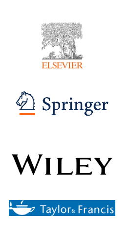
```
]

---

# Un accès difficile aux résultats de la recherche dans le monde

.center[
```{r echo=FALSE, out.height=400, out.width=1000}
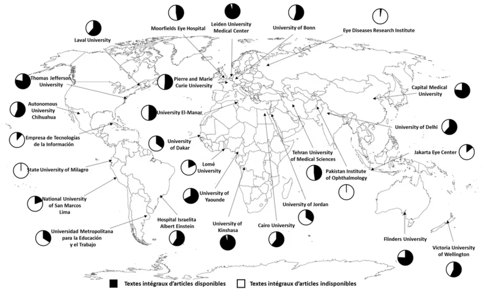
```
]

<small>Source : Boudry, Christophe, Patricio Alvarez-Muñoz, Ricardo Arencibia-Jorge, Didier Ayena, Niels J. Brouwer, Zia Chaudhuri, Brenda Chawner, et al. 2019. « Worldwide Inequality in Access to Full Text Scientific Articles: The Example of Ophthalmology ». PeerJ 7 (octobre): e7850. https://doi.org/10.7717/peerj.7850.</small>

---

# Open access

## Entre initiatives des pionniers, dark open access et politiques institutionnelles

.pull-left[
- 1991 : lancement d’ArXiv, développé par Paul Ginsparg
- 1999 : lancement de E-biomed, aujourd’hui PubMed Central, sous l’impulsion de Harold Varmus
- 2001 : ouverture de HAL
- 2002 : Budapest Open Access Initiative
- 2011 : lancement de Sci-Hub…
- 2012 : San Francisco Declaration on Research Assessment (DORA)
- 2016 : Amsterdam Call for Action on Open Science 
]

.pull-right[
```{r echo=FALSE, out.height=156, out.width=355}
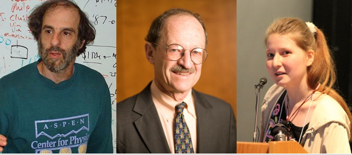
```
]

<small>Sources : Pogens. “Paul Ginsparg”, CC BY-SA 3.0. https://commons.wikimedia.org/wiki/File:Ginsparg_at_Cornell_University.jpg. Matthew Septimus (photographer), “Harold Varmus”, CC BY-SA 4.0. https://commons.wikimedia.org/wiki/File:National_Cancer_Institute_director_Harold_E._Varmus_(3)_(cropped).jpg. Apneet Jolly, “Alexandra Elbakyan, CC BY 2.0. https://commons.wikimedia.org/wiki/File:Alexandra_Elbakyan_(cropped).jpg</small> 

---

.pull-left[
# L'open access, plusieurs voies
]

.pull-right[
```{r echo=FALSE, out.height=500, out.width=375}
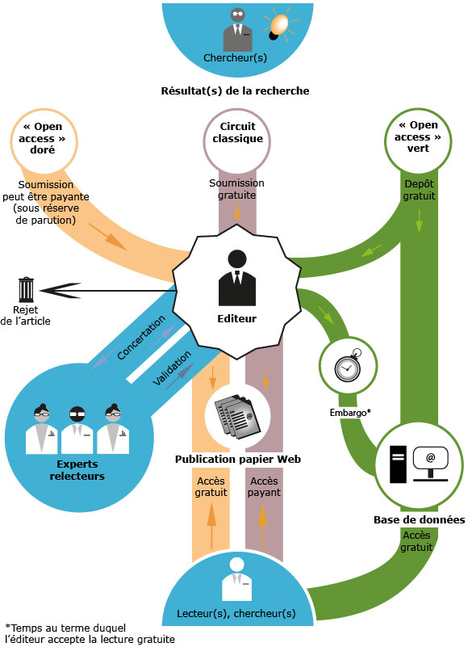
```
]

<small>Source : Larousserie, David, et Sandrine Cabut. 2013. « A qui appartient le savoir ? » Le Monde.fr, 28 février 2013. https://www.lemonde.fr/sciences/article/2013/02/28/a-qui-appartient-le-savoir_1840797_1650684.html.</small>

---

class: center, inverse, middle

# Ouvrir les données de la recherche

---

class: middle

# Données de la recherche : définition - 1

>"Enregistrements factuels (chiffres, textes, images et sons) qui sont utilisés comme sources principales pour la recherche scientifique et sont généralement reconnus par la communauté scientifique comme nécessaires pour valider des résultats de recherche."

OECD. 2007. « OECD Principles and Guidelines for Access to Research Data from Public Funding ». https://www.oecd.org/sti/inno/38500813.pdf.

---

class: middle

# Données de la recherche : définition - 2

>« Research data means data in the form of facts, observations, images, computer program results, recordings, measurements or experiences on which an argument, theory, test or hypothesis, or another research output is based. 
Data may be numerical, descriptive, visual or tactile. It may be raw, cleaned or processed, and may be held in any format or media. »

DANS, « What Is Research Data », 2017. https://www.ands.org.au/__data/assets/pdf_file/0006/731823/Whatis-research-data.pdf

---

# Quels types de données ?

.center[
```{r echo=FALSE, out.height=486, out.width=805}
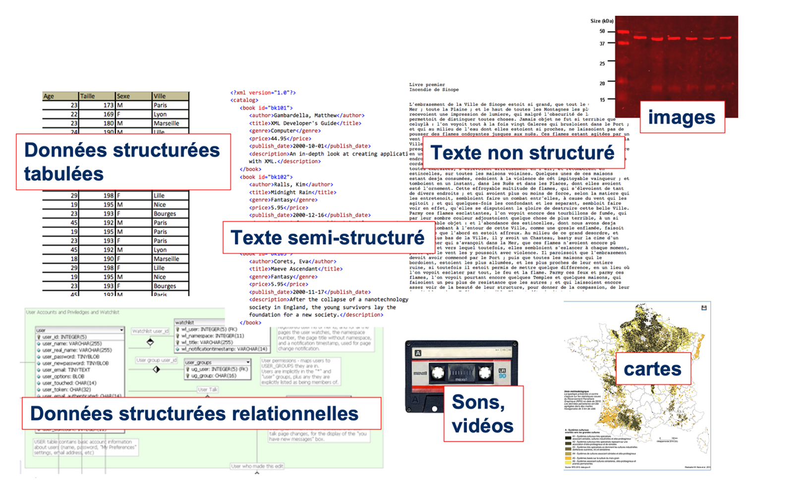
```
]

<small>Source : Mathieu Saby, 2019, https://osf.io/d3xy4/</small>

---

class: middle

# Quels bénéfices pour le producteur de données ?

* Une **conformité** avec les exigences des financeurs en faveur de la science ouverte
* Davantage de **transparence** dans le processus de recherche
* Une meilleure **visibilité** pour les chercheurs
* Davantage d’**impact** potentiel de la recherche
* Une plus grande **efficacité** (et une meilleure gestion des coûts de gestion)
* De meilleures possibilités de **collaboration**
* Davantage de **citations** :
  * Colavizza, Giovanni, Iain Hrynaszkiewicz, Isla Staden, Kirstie Whitaker, et Barbara McGillivray. 2020. « The citation advantage of linking publications to research data ». PLOS ONE 15 (4): e0230416. https://doi.org/10.1371/journal.pone.0230416.
  
---

class: middle

# Pourquoi diffuser si largement ? 

* Utilité sociale : un [exemple](https://madada.fr/demande/donnees_relatives_a_la_concentra) 
* Utilité politique (informer le débat public) 
* Utilité économique (volonté européenne d'une réutilisation par des entreprises) 
* Retour sur investissement de la recherche publique (restituer aux citoyens le produit de ce qu'ils ont financé)
* Constitution d’un patrimoine scientifique nativement numérique

---

class: middle

# Pourquoi ouvrir les données ? 

* 50 % des expériences sont considérées comme **non-reproductibles**. 
* 80 % des données produites ces 20 dernières années seraient **perdues**.
* Plus de 80 % des données produites sont **stockées ailleurs que dans des entrepôts**. 

*DATACC. « Gestion des données : une nouvelle exigence, de nouvelles compétences », 2020.* https://www.datacc.org/bonnes-pratiques/adopter-un-plan-de-gestion-des-donnees/gestion-des-donnees-une-nouvelle-exigence-de-nouvelles-competences/

---

class: middle

# Les données sont fragiles !

**Chaque année augmente de 17% le risque de non-disponibilité des données.**

.center[
```{r echo=FALSE, out.height=300, out.width=500}
knitr::include_graphics("img/perte-donnees.png")
```
]

<small>Vines et al., The Availability of Research Data Declines Rapidly with Article Age. Current Biology 24 , 94–97, January 6, 2014 https://doi.org/10.1016/j.cub.2013.11.014</small>

---

class: middle

# Un enjeu, préserver le patrimoine scientifique

.pull-left[
```{r echo=FALSE, out.height=300, out.width=200}
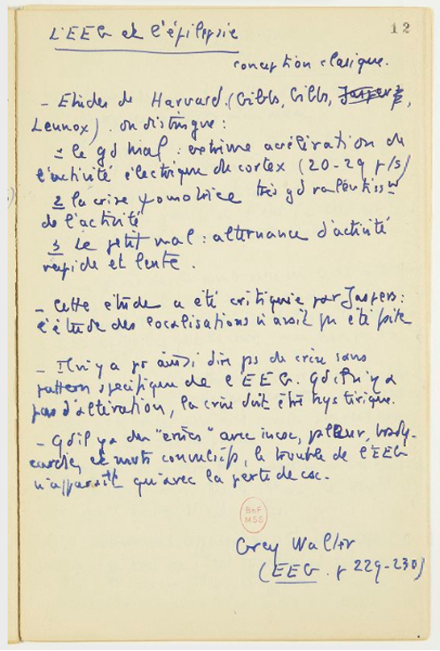
```
]

.pull-right[
```{r echo=FALSE, out.height=300, out.width=200}
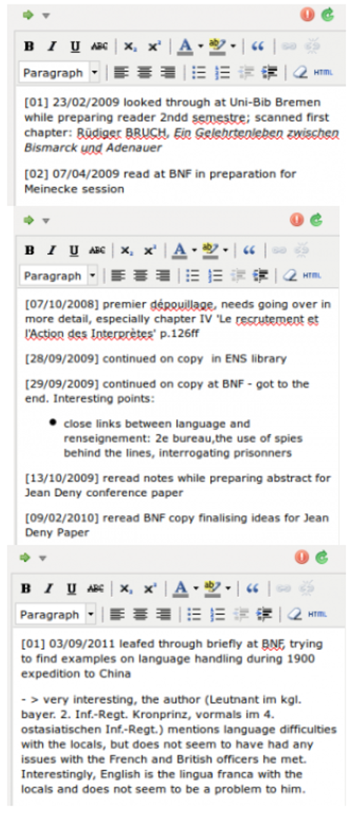
```
]

<small>Sources :
* Fonds Michel Foucault. Notes de lecture et manuscrits. Notes de lecture des débuts, 1952-1955. Neurophysiologie Lagache & EEG. NAF 28730 (44 A). https://gallica.bnf.fr/ark:/12148/btv1b525128619/f12.item
* Heimburger, Franziska. « Gérer la documentation II - une approche possible utilisant Zotero ». La boîte à outils des historiens (blog), 2012. http://www.boiteaoutils.info/2012/11/gerer-la-documentation-ii-une-approcha/</small>

---

class: middle

# Codes et logiciels : partage et archivage

* Plateformes de développement collaboratif, “**forges logicielles**” : 
  * GitHub, GitLab.com, BitBucket, instances de GitLab institutionnelles, etc.
  * Finalité : développer un logiciel de façon collaborative
  * Risques : **aucune garantie de pérennité** (nombreux exemples de fermetures brutales : Gitorious.org, Google Code, Bitbucket)
  * Ne remplacent pas un archivage pérenne !

* **Archives** :
  * [Software Heritage](https://www.softwareheritage.org/?lang=fr)
* Finalité : garantir une conservation et un accès pérennes
* Enjeux : **garantir l’accès et la possibilité d’utiliser des codes et des logiciels de manière pérenne**
* Constituer un **patrimoine informatique** 

---

class: middle
background-color: #7a6666

# Idée reçue 2 

## Ouvrir les données, c'est risquer d'être plagié ?

* **Plagiat ?** Mettre sa thèse en ligne garantit un horodatage 
* Risques liés à la **vie privée ?** Respecter le RGPD
* **Sécurité** des données ? Données concernées par la notion de secret ?
* **Utilisation malveillante** des données ? Le plus compliqué à anticiper

Un principe : « Ouvrir autant que possible, fermer autant que nécessaire »

---

class: center, inverse, middle

# Quel parcours pour ce type de poste ?

---

class: middle

# Expérience personnelle

 - Maîtrise de lettres modernes
 - DUT métiers du livre
 - Bibliothécaire assistante spécialisée : des fonctions très classiques
 - Concours de conservateur : des fonctions encore classiques…
 - Mutation
 - Autoformation
 - Données de la recherche !
 
---

class: middle
background-color: #7a6666

# Les journées d'une chargée de mission Données

- Formations des enseignants-chercheurs et des étudiants
- Accompagnement des équipes de recherche
- Réunions variées
- Participation à des groupes de travail
- Autoformation

---

class: center, middle
background-color: #bebebe

# Quizz science ouverte - suite

---

class: center, middle
background-color: #bebebe

# Quizz science ouverte

## Que permet la licence CC:BY ?

1. L'oeuvre ne peut être réutilisée que par son auteur
2. L'oeuvre peut être réutilisée par quiconque mais l'auteur doit être citée

---

class: center, middle
background-color: #bebebe

# Quizz science ouverte

## Qu'est-ce qu'une métadonnée ?

1. Une information décrivant une donnée
2. Une donnée très volumineuse
3. Un annuaire de données
4. Une donnée métaphysique 

---

class: center, middle
background-color: #bebebe

# Quizz science ouverte

## Le(s)quel(s) de ces éléments correspond à une donnée personnelle ?

1. La photo d'une personne de dos
2. La photo d'une personne de profil
3. Un souvenir conservé de puis l'enfance
4. Un numéro de portable

---

class: center, middle
background-color: #bebebe

# Quizz science ouverte

## Lequel de ces élémetnts n'est pas une clause des licences Creative Commons ?

1. Attribution (BY)
2. Utilisation pour la recherche (USR)
3. Partage dans les mêmes conditions (SA)
4. Pas d'utilisation commerciale (NC)

---

class: center, middle
background-color: #bebebe

# Quizz science ouverte

## Que permet l'archivage pérenne ?

1. Conserver le document à long terme
2. Le rendre accessible à long terme
3. Permettre sa réutilisation

---

class: center, middle
background-color: #bebebe

# Quizz science ouverte

## Dans le cadre d'un projet, il faut s'accorder sur les règles de gestion et de partage des données

1. Vrai
2. Faux

---

class: center, middle
background-color: #bebebe

# Quizz science ouverte

## Pourquoi est-il important de décrire vos données quand vous les déposez dans un entrepôt ?

1. Pour gagner le grand prix de l'excellence scientifique
2. Pour vous rappeler ce que vous avez déposé
3. Pour faciliter la réutilisation de vos données par d'autres chercheurs

---

class: center, middle
background-color: #bebebe

# Quizz science ouverte

## Qu'est-ce que la règle du 3-2-1 ?

1. La règle de répartition des bénéfices entre l'éditeur, l'imprimeur et l'auteur
2. La règle qui permet de trier les entrepôts de données fiables
3. La règle de sécurisation physique des données

---

class: center, middle
background-color: #bebebe

# Quizz science ouverte

## Une archive ouverte est

1. Un entrepôt de documents diffusés en accès ouvert sur internet
2. Une bibliothèque en libre-service ouverte 24h/24h
3. Un lieu de stockage et de consultation des documents administratifs

---

class: center, middle
background-color: #bebebe

# Quizz science ouverte

## Les données sont nécessairement ouvertes

1. Vrai
2. Faux

---

class: center, middle
background-color: #bebebe

# Quizz science ouverte

## Pourquoi les données doivent-elles disposer d'un identifiant pérenne ?

1. Pour qu'elles soient facilement citables
2. Pour qu'elles soient trouvables, visibles et accessibles
3. Pour pouvoir les lier aux publications ou à tout autre produit de recherche

---

class: center, middle
background-color: #bebebe

# Quizz science ouverte

## Convention de nommage ? L'essentiel est que je m'y retrouve dans le nommage de mes fichiers ?

1. Vrai
2. Faux

---

class: center, middle
background-color: #bebebe

# Quizz science ouverte

## Parmi ces formats de fichiers, lesquels sont ouverts ?

1. csv
2. pdf
3. doc
4. txt.
e. avi

---

class: center, middle
background-color: #bebebe

# Quizz science ouverte solutions

Source : Marlène Delhaye, Isabelle Gras, Julien Caugant, & Caroline-Sophie Donati. (2020, September 22). « À l'asSO ! » : apprentissage ludique de la Science Ouverte à AMU. Zenodo. https://doi.org/10.5281/zenodo.4043644

&nbsp;

Retrouver l'intégralité des questions et les solutions : https://zenodo.org/record/4043644#:~:text=BU%2DALASSO%2DQUESTIONS.pdf

&nbsp;

Questions utilisées : 1, 3, 4, 6, 11, 14, 16, 17, 19, 21, 24, 25, 29, 34, 39, 41, 42, 45, 48, 49, 51, 54, 56, 57, 59, 60

---

class: center, middle, inverse

# Conclusion, conseils de lectures

---

class: middle

# Conclusion

- Un domaine évoluant très rapidement
- Un effet de mode de la donnée ?
- Des opportunités pour davantage d'accès aux connaissances

---

class: middle

# Lectures sur les données

* Borgman, Christine L. 2020. **Qu’est-ce que le travail scientifique des données ? : Big data, little data, no data**. Traduit par Charlotte Matoussowsky. Marseille: OpenEdition Press. http://books.openedition.org/oep/14692.
* Leonelli, Sabina. 2019. **La recherche scientifique à l’ère des big data: cinq façons dont les big data nuisent à la science et comment la sauver**. Mimésis.

---

class: center, middle, inverse

# Des questions, des commentaires sur cette demi-journée ?

---

class: center, inverse, middle

# Merci de votre attention !

Cécile Arènes  <a href="https://orcid.org/0000-0002-1839-3530"></a>, [cecile.arenes@sorbonne-universite.fr](mailto:cecile.arenes@sorbonne-universite.fr) et [@carenes](https://twitter.com/carenes)


```{r echo=FALSE, out.height=50, out.width=150}
knitr::include_graphics("img/ccby.png")
```

Slides : R package [xaringan](https://github.com/yihui/xaringan),  [remark.js](https://remarkjs.com), [knitr](https://yihui.org/knitr/) et [R Markdown](https://rmarkdown.rstudio.com).
